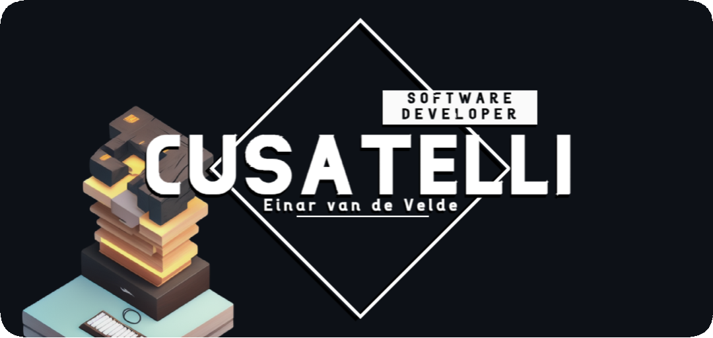

## 

# 👋 Hello there! Welcome to my GitHub profile!

I'm thrilled to have you here, exploring my world of **creativity**, **innovation**, and **collaboration**. Allow me to give you a glimpse of what you'll find in my repositories.

I'm a passionate developer who loves crafting software solutions that make a **positive impact**.

As you browse through my profile, you'll discover a collection of repositories that demonstrate my expertise in various programming languages, frameworks, and technologies. From web development to data analysis, machine learning to mobile applications, my work should reflect my **versatility** and **thirst for knowledge**.

Each repository provides insights into my problem-solving abilities, coding style, and dedication to producing clean, well-documented code. Whether you're a fellow developer, a recruiter, or simply an enthusiast, I hope there's something here for everyone to learn and appreciate.

Feel free to dive into my projects, learn from my code, and don't hesitate to reach out if you have any inquiries. Be sure to follow along to stay updated on my future endeavors and witness my growth as a software developer.

**Thank you for visiting my GitHub profile, and enjoy!**

### 

    
    
    
    
    
    
    
    
    
    

### 

 

	
	
	
	
	
	
	

### 

 

	
	
	
	
	
	
	
	
	
	
	

### 

 

	
	
	
	
	
	
	
	
	

## 

<table align="center">
	<tr>
		<td style="text-align:right;">
			<picture>
				<source
					srcset="https://github-readme-stats.vercel.app/api/top-langs?username=Cusatelli&langs_count=15&layout=donut&hide_border=true&show_icons=true&hide=TeX&size_weight=0.5&count_weight=0.5&theme=transparent&hide_title=true&text_color=fffefe"
					media="(prefers-color-scheme: dark)"
				/>
				<source
					srcset="https://github-readme-stats.vercel.app/api/top-langs?username=Cusatelli&langs_count=15&layout=donut&hide_border=true&show_icons=true&hide=TeX&hide_title=true&size_weight=0.5&count_weight=0.5&theme=default"
					media="(prefers-color-scheme: light), (prefers-color-scheme: no-preference)"
				/>
				
			</picture>
		</td>
		<td style="text-align:left;">
			<picture>
				<source
					srcset="https://github-readme-stats.vercel.app/api?username=Cusatelli&hide_border=true&show_icons=true&hide=contribs&theme=transparent&hide_title=true&text_color=fffefe"
					media="(prefers-color-scheme: dark)"
				/>
				<source
					srcset="https://github-readme-stats.vercel.app/api?username=Cusatelli&hide_border=true&show_icons=true&hide=contribs&hide_title=true&theme=default"
					media="(prefers-color-scheme: light), (prefers-color-scheme: no-preference)"
				/>
				
			</picture>
		</td>
	</tr>
</table>

## 

<table align="center">
	<tr>
		<td>
			

				<h2>Websites</h2> <!-- omit in toc -->
				<h3>
					🌐 <a href="https://www.cusatelli.com">www.cusatelli.com</a>
				</h3> <!-- omit in toc -->
				<h3>
					🌐 <a href="https://www.einarvandevelde.com">www.einarvandevelde.com</a>
				</h3> <!-- omit in toc -->
			

		</td>
	    	<td>
			

				<h2>Socials</h2> <!-- omit in toc -->
				<h3>
					💬 <a href="https://www.linkedin.com/in/einarvandevelde">linkedin.com/in/einarvandevelde</a>
				</h3> <!-- omit in toc -->
				<h3>
					📧 <a href="mailto:github.cusatelli@gmail.com">github.cusatelli@gmail.com</a>
				</h3> <!-- omit in toc -->
			

		</td>
	</tr>
</table>

