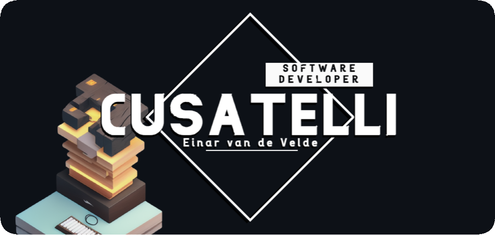

## 

# 👋 Welcome to my GitHub!

Here you'll find projects in different languages and technologies, including web, data, and mobile.

Check out my repositories to see my code and how I solve problems.  
If you have questions or want to connect, feel free to reach out.

**Thanks for visiting!**

### 

    
    
    
    
    
    
    
    
    
    

### 

 

	
	
	
	
	
	
	

### 

 

	
	
	
	
	
	
	
	
	
	
	

### 

 

	
	
	
	
	
	
	
	
	

## 

<table align="center">
	<tr>
		<td style="text-align:right;">
			<picture>
				<source
					srcset="https://github-readme-stats.vercel.app/api/top-langs?username=Cusatelli&langs_count=15&layout=donut&hide_border=true&show_icons=true&hide=TeX&size_weight=0.5&count_weight=0.5&theme=transparent&hide_title=true&text_color=fffefe"
					media="(prefers-color-scheme: dark)"
				/>
				<source
					srcset="https://github-readme-stats.vercel.app/api/top-langs?username=Cusatelli&langs_count=15&layout=donut&hide_border=true&show_icons=true&hide=TeX&hide_title=true&size_weight=0.5&count_weight=0.5&theme=default"
					media="(prefers-color-scheme: light), (prefers-color-scheme: no-preference)"
				/>
				
			</picture>
		</td>
		<td style="text-align:left;">
			<picture>
				<source
					srcset="https://github-readme-stats.vercel.app/api?username=Cusatelli&hide_border=true&show_icons=true&hide=contribs&theme=transparent&hide_title=true&text_color=fffefe"
					media="(prefers-color-scheme: dark)"
				/>
				<source
					srcset="https://github-readme-stats.vercel.app/api?username=Cusatelli&hide_border=true&show_icons=true&hide=contribs&hide_title=true&theme=default"
					media="(prefers-color-scheme: light), (prefers-color-scheme: no-preference)"
				/>
				
			</picture>
		</td>
	</tr>
</table>

## 

<table align="center">
	<tr>
		<td>
			

				<h2>Websites</h2> <!-- omit in toc -->
				<h3>
					🌐 <a href="https://www.cusatelli.com">www.cusatelli.com</a>
				</h3> <!-- omit in toc -->
				<h3>
					🌐 <a href="https://www.einarvandevelde.com">www.einarvandevelde.com</a>
				</h3> <!-- omit in toc -->
			

		</td>
	    	<td>
			

				<h2>Socials</h2> <!-- omit in toc -->
				<h3>
					💬 <a href="https://www.linkedin.com/in/einarvandevelde">linkedin.com/in/einarvandevelde</a>
				</h3> <!-- omit in toc -->
				<h3>
					📧 <a href="mailto:github.cusatelli@gmail.com">github.cusatelli@gmail.com</a>
				</h3> <!-- omit in toc -->
			

		</td>
	</tr>
</table>

